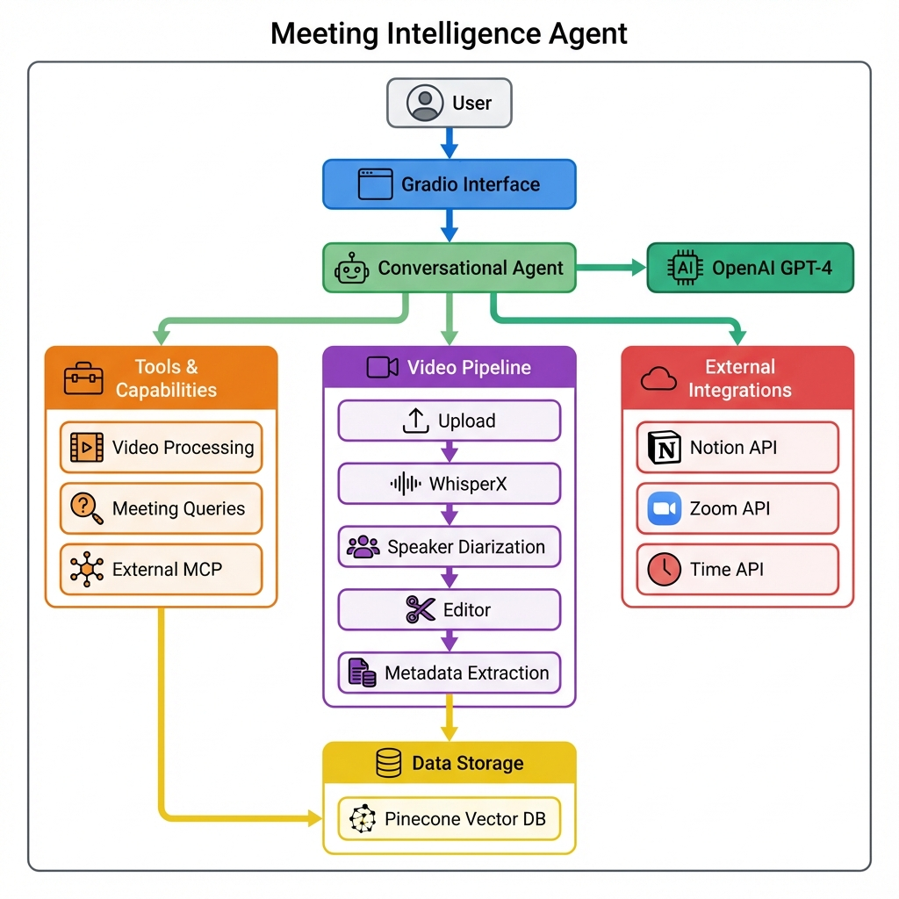
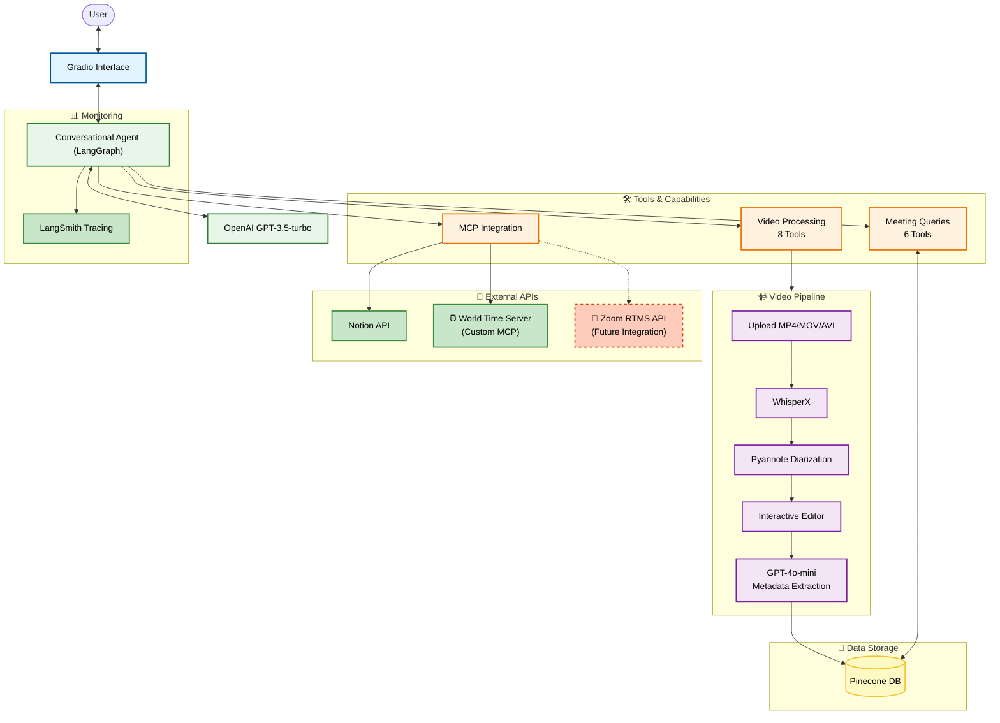

## **Final README.md (Improved Version)**

# 🎙️ Meeting Intelligence Agent

> **AI-powered assistant for meeting transcription, analysis, and management.**

This project implements an intelligent conversational agent that orchestrates the entire meeting intelligence workflow. It allows users to upload video recordings, automatically transcribe them with speaker identification, edit transcripts, store them in a vector database (Pinecone), and perform advanced RAG (Retrieval-Augmented Generation) queries to extract insights, summaries, and action items.


---

## 🌟 Features

- **🗣️ Natural Language Interface**: Control everything through a chat-based agent using LangGraph.
- **🌍 Local/Cloud Deployment**: Docker + Hugging Face Spaces.

- **📹 Video Analysis Pipeline**:
  - Upload MP4/MOV/AVI files directly.
  - **WhisperX Transcription**: High-accuracy speech-to-text.
  - **Speaker Diarization**: Automatically distinguishes between different speakers.
  - **Smart Speaker Mapping**: LLM intelligently assigns real names to speaker labels (e.g., "Speaker_01" → "Alice") from context.

- **✏️ Interactive Editor**: Review and correct transcripts before commiting them to the database.
- **🧠 Semantic Search (RAG)**:
  - Stores meetings in **Pinecone** vector database.
  - Intelligent metadata extraction (Titles, Dates, Summaries) using GPT-4o-mini.
  - **Time-Aware Queries**: Understands relative time (e.g., *"What did we discuss 2 weeks ago?"*) using a dedicated Time MCP server.
  - Ask questions like *"What did we decide about the budget?"* or *"List all action items for John"*.
- **🔌 MCP Integration (Model Context Protocol)**:
  - Connects to external tools like **Notion** to export meeting minutes directly.
  - **Custom Time Server**: World time queries for relative date calculations.
  - **Zoom Integration**: (Future) Real-time meeting capture via RTMS API.
- **📊 LangSmith Integration**: Full tracing and monitoring of agent workflows.

---

## 📚 Documentation

**Additional Documentation Files**

For detailed technical documentation, see:
- [ARCHITECTURE.md](documentation/ARCHITECTURE.md) - Full system design
- [TECHNICAL_IMPLEMENTATION.md](documentation/TECHNICAL_IMPLEMENTATION.md) - Complete tool reference and Mermaid diagrams
- [DEPLOYMENT_GUIDE.md](documentation/DEPLOYMENT_GUIDE.md) - Step-by-step deployment guide
- [Pinecone Management Script](scripts/manage_pinecone.py) - Utility for database management

---

## 🏗️ System Architecture





---

## 🚀 Quick Start

### Prerequisites

- Python 3.11
- FFmpeg (required for audio processing)
- Node.js & npm (optional, required if using Notion MCP integration)
- Pinecone Account
- OpenAI API Key

### Installation

1. **Clone the repository:**
   ```bash
   git clone https://github.com/yourusername/meeting-agent.git
   cd meeting-agent
   ```

2. **Install dependencies:**
   ```bash
   pip install -r requirements.txt
   ```

3. **Configure Environment:**
   Create a `.env` file in the root directory:
   ```bash
   OPENAI_API_KEY=your_openai_key
   PINECONE_API_KEY=your_pinecone_key
   PINECONE_INDEX=your_index_name
   PINECONE_ENVIRONMENT=us-east-1
   
   # Optional: For Notion MCP
   ENABLE_MCP=true
   NOTION_TOKEN=your_notion_key
   
   # LangSmith (optional)
   LANGSMITH_API_KEY=your_langsmith_key
   LANGSMITH_PROJECT=meeting-agent
   ```

4. **Run the Application:**
   ```bash
   python app.py
   ```
   Access the UI at `http://localhost:7860`.

### Pinecone Management

Manage your vector database with the included utility:
```bash
# List all meetings
python scripts/manage_pinecone.py list

# View statistics
python scripts/manage_pinecone.py stats

# Delete specific meeting
python scripts/manage_pinecone.py delete meeting_abc12345
```

---

## 🐳 Docker Support

Build and run the application in a container.

1. **Build the image:**
   ```bash
   docker build -t meeting-agent .
   ```

    > **⚠️ IMPORTANT FOR HUGGING FACE SPACES:**  
    > Standard Gradio deployment may fail due to specific dependency conflicts (WhisperX/Pyannote).  
    > **You must use Docker** for deployment.  
    > Use `requirements_hf.txt` (rename it to `requirements.txt` inside your deployment repo) which contains safe, Linux-compatible version ranges. The standard `requirements.txt` is optimized for local Mac/Dev environments.

2. **Run the container:**
   ```bash
   docker run -p 7860:7860 --env-file .env meeting-agent
   ```

---

## 🌐 Live Demo & Deployment

### Hugging Face Spaces
- **Live Demo**: [https://huggingface.co/spaces/GFiaMon/meeting-agent-docker](https://huggingface.co/spaces/GFiaMon/meeting-agent-docker)
- **One-Click Clone**: Click "Duplicate Space" on the Hugging Face page to deploy your own instance
- **Auto-Deploy**: Cloned spaces automatically build as Docker containers with all dependencies

### Custom MCP Servers
- **⏰ World Time Server**: A custom MCP server for timezone-aware queries deployed at [https://huggingface.co/spaces/GFiaMon/date_time_mpc_server_tool](https://huggingface.co/spaces/GFiaMon/date_time_mpc_server_tool) (Can be cloned or connected as an external MCP server to an AI agent)

- **🎥 Zoom RTMS Integration**: In development (`external_mcp_servers/zoom_mcp/`), working with Zoom's API team

---

## 📁 Project Structure

```
meeting-agent/
├── app.py                # 🚀 Entry point (Gradio App)
├── src/
│   ├── agents/           # LangGraph Agent definition
│   ├── config/           # Configuration & Settings
│   ├── processing/       # Audio/Video processing pipelines
│   ├── retrievers/       # Pinecone & RAG logic
│   ├── tools/            # Tool definitions (Video, General, MCP)
│   └── ui/               # Gradio UI components
├── external_mcp_servers/ # 🔧 Custom MCP servers
│   ├── time_mcp_server/  # ⏰ World Time Server (Gradio app)
│   └── zoom_mcp/         # 🎥 Zoom RTMS (prototype, in development)
├── archive/              # Deprecated code & experiments (only on local repo)
├── scripts/              # Helper scripts
│   ├── manage_pinecone.py  # Pinecone index management utility
│   └── setup_pinecone.py   # Initial Pinecone setup
├── documentation/        # Technical Documentation
└── requirements.txt      # Dependencies
```

---

## 📊 Monitoring & Evaluation

### LangSmith Integration
The agent integrates with LangSmith for comprehensive tracing and monitoring:
- **Prompt/Response Tracking**: All agent interactions are logged
- **Tool Usage**: Complete tool execution history
- **Performance Metrics**: Latency and token usage tracking
- **Debugging**: Easy identification of issues in complex workflows

### Basic Evaluation
While full quantitative metrics are a future enhancement, the system includes:
- **Functional Testing**: All tools tested end-to-end
- **Integration Testing**: Pinecone, Notion, and MCP connections verified

---

## 🔌 MCP Integration Details

### Current MCP Servers
1. **Notion MCP**: Official `@notionhq/notion-mcp-server` for [Notion API access](https://developers.notion.com/docs/mcp)
2. **World Time Server**: Custom Gradio-based MCP server for timezone-aware queries
3. **Zoom RTMS**: Prototype for future Zoom integration (in development)

### Time-Aware Queries Example
The custom Time MCP server enables queries like:
- *"What did we discuss last Tuesday?"*
- *"Show me meetings from 2 weeks ago"*
- *"What action items were assigned in December?"*

The server calculates relative dates and provides timezone-aware timestamps for accurate meeting retrieval.

---

## 🔮 Future Enhancements

### In Development
- **Zoom RTMS API Integration**: Real-time meeting transcription and capture
- **Enhanced Metrics**: Quantitative evaluation with LangSmith
- **Batch Processing**: Handle multiple meetings simultaneously

### Planned Features
- **Multi-language Support**: Transcription in 10+ languages
- **Advanced Analytics**: Sentiment analysis, speaker analytics
- **Export Formats**: PDF, Google Docs, etc


---

## 🤝 Contributing

1. Fork the Project
2. Create your Feature Branch (`git checkout -b feature/AmazingFeature`)
3. Commit your Changes (`git commit -m 'Add some AmazingFeature'`)
4. Push to the Branch (`git push origin feature/AmazingFeature`)
5. Open a Pull Request

---

## 📄 License

Distributed under the MIT License. See `LICENSE` for more information.

---

## 🙏 Acknowledgments

- **Ironhack Data Science & AI Program** - Course framework and guidance
- **OpenAI** - Whisper and GPT models
- **WhisperX** - Audio/Video processing
- **Pinecone** - Vector database
- **Notion** - Notion API access
- **LangChain** - Agent framework and tools
- **Hugging Face** - Deployment platform and community

---

## 📧 Contact

<!-- Your Name - [your.email@example.com](mailto:your.email@example.com) -->

[LinkedIn](https://www.linkedin.com/in/guillermo-fiallo-montero-734a87132/)

Project Link: [https://github.com/GFiaMon/meeting-intelligence-agent](https://github.com/GFiaMon/meeting-intelligence-agent)

---

**Capstone Project** - Ironhack Data Science & AI Program - December 2025
