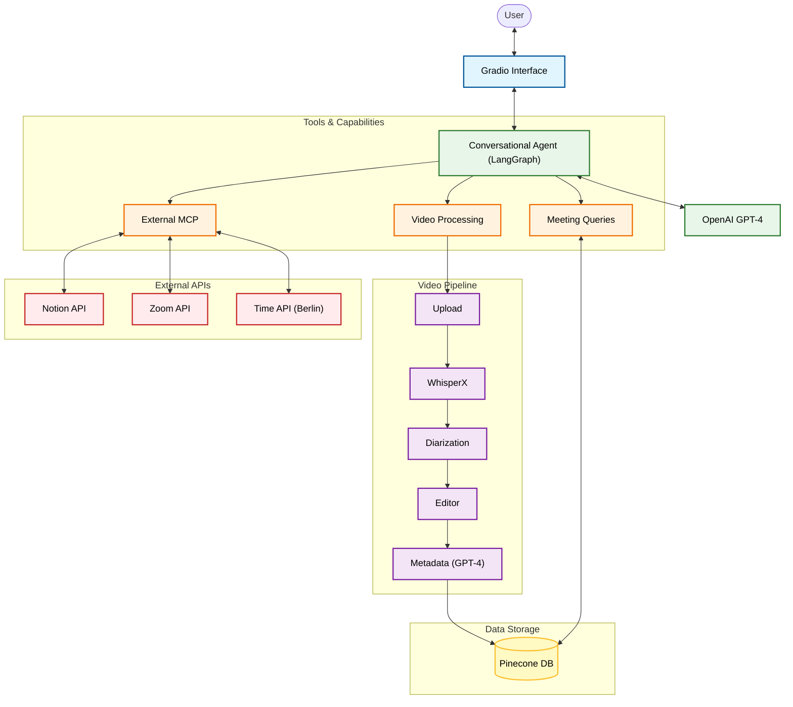

# 🎙️ Meeting Intelligence Agent

> **AI-powered assistant for meeting transcription, analysis, and management.**

This project implements an intelligent conversational agent that orchestrates the entire meeting intelligence workflow. It allows users to upload video recordings, automatically transcribe them with speaker identification, edit transcripts, store them in a vector database (Pinecone), and perform advanced RAG (Retrieval-Augmented Generation) queries to extract insights, summaries, and action items.


---

## 🌟 Features

- **🗣️ Natural Language Interface**: Control everything through a chat-based agent using LangGraph.
- **📹 Video Analysis Pipeline**:
  - Upload MP4/MOV/AVI files directly.
  - **WhisperX Transcription**: High-accuracy speech-to-text.
  - **Speaker Diarization**: Automatically distinguishes between different speakers.
  - **Smart Speaker Mapping**: LLM intelligently assigns real names to speaker labels (e.g., "Speaker_01" → "Alice") from context.
- **✏️ Interactive Editor**: Review and correct transcripts before commiting them to the database.
- **🧠 Semantic Search (RAG)**:
  - Stores meetings in **Pinecone** vector database.
  - Intelligent metadata extraction (Titles, Dates, Summaries) using GPT-4o-mini.
  - **Time-Aware Queries**: Understands relative time (e.g., *"What did we discuss 2 weeks ago?"*) using a dedicated Time MCP server.
  - Ask questions like *"What did we decide about the budget?"* or *"List all action items for John"*.
- **🔌 MCP Integration (Model Context Protocol)**:
  - Connects to external tools like **Notion** to export meeting minutes directly.
  - Extensible architecture for adding more servers (e.g., Zoom, Time/Date).

## 🏗️ System Architecture




## 🚀 Quick Start

### Prerequisites

- Python 3.10+
- FFmpeg (required for audio processing)
- Node.js & npm (optional, required if using Notion MCP integration)
- Pinecone Account
- OpenAI API Key

### Installation

1. **Clone the repository:**
   ```bash
   git clone https://github.com/yourusername/meeting-agent.git
   cd meeting-agent
   ```

2. **Install dependencies:**
   ```bash
   pip install -r requirements.txt
   ```

3. **Configure Environment:**
   Create a `.env` file in the root directory:
   ```bash
   OPENAI_API_KEY=your_openai_key
   PINECONE_API_KEY=your_pinecone_key
   PINECONE_INDEX=your_index_name
   PINECONE_ENVIRONMENT=us-east-1
   
   # Optional: For Notion MCP
   ENABLE_MCP=true
   NOTION_TOKEN=your_notion_key
   ```

4. **Run the Application:**
   ```bash
   python app.py
   ```
   Access the UI at `http://localhost:7862`.

## 🐳 Docker Support

Build and run the application in a container.

1. **Build the image:**
   ```bash
   docker build -t meeting-agent .
   ```

    > **⚠️ IMPORTANT FOR HUGGING FACE SPACES:**  
    > Standard Gradio deployment may fail due to specific dependency conflicts (WhisperX/Pyannote).  
    > **You must use Docker** for deployment.  
    > Use `requirements_hf.txt` (rename it to `requirements.txt` inside your deployment repo) which contains safe, Linux-compatible version ranges. The standard `requirements.txt` is optimized for local Mac/Dev environments.

2. **Run the container:**
   ```bash
   docker run -p 7860:7860 --env-file .env meeting-agent
   ```

## 📁 Project Structure

```
meeting-agent/
├── app.py                # 🚀 Entry point (Gradio App)
├── src/
│   ├── agents/           # LangGraph Agent definition
│   ├── config/           # Configuration & Settings
│   ├── processing/       # Audio/Video processing pipelines
│   ├── retrievers/       # Pinecone & RAG logic
│   ├── tools/            # Tool definitions (Video, General, MCP)
│   └── ui/               # Gradio UI components
├── archive/              # Deprecated code & experiments
├── scripts/              # Helper scripts
└── requirements.txt      # Dependencies
```

## 🤝 Contributing

1. Fork the Project
2. Create your Feature Branch (`git checkout -b feature/AmazingFeature`)
3. Commit your Changes (`git commit -m 'Add some AmazingFeature'`)
4. Push to the Branch (`git push origin feature/AmazingFeature`)
5. Open a Pull Request
