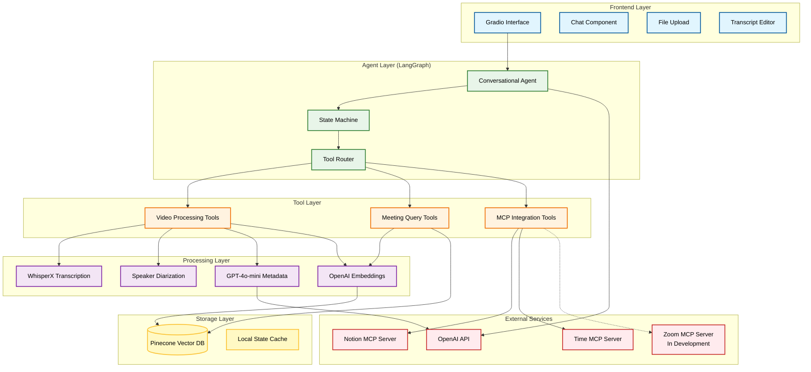

# System Architecture

> **Meeting Intelligence Agent - Technical Architecture Documentation**

This document provides a high-level overview of the system architecture, design decisions, and component relationships for the Meeting Intelligence Agent.

---

## 📋 Table of Contents

- [System Overview](#-system-overview)
- [Architecture Diagram](#-architecture-diagram)
- [Core Components](#-core-components)
- [Data Flow](#-data-flow)
- [Key Design Decisions](#-key-design-decisions)
- [State Management](#-state-management)
- [Scalability & Performance](#-scalability--performance)
- [Security Architecture](#-security-architecture)
- [Technology Stack](#-technology-stack)

---

## 🎯 System Overview

The Meeting Intelligence Agent is a **conversational AI system** built on LangGraph that orchestrates meeting video processing, transcription, storage, and intelligent querying through natural language interaction.

### Core Capabilities

1. **Video Processing Pipeline**: Upload → Transcription → Speaker Diarization → Metadata Extraction → Vector Storage
2. **Semantic Search**: RAG-based querying across meeting transcripts using natural language
3. **External Integrations**: MCP (Model Context Protocol) servers for Notion and time-aware queries
4. **Conversational Interface**: Gradio-based chat UI with file upload support

### Design Philosophy

- **Conversational-First**: All functionality accessible through natural language
- **Modular Architecture**: Clear separation between UI, agent, tools, and services
- **Extensible**: MCP protocol enables easy addition of new capabilities
- **Async-Ready**: Supports long-running operations (transcription, MCP calls)
- **Production-Ready**: Docker support, error handling, graceful degradation

---

## 🏗️ Architecture Diagram



---

## 🧩 Core Components

### 1. Frontend Layer (Gradio)

**Purpose**: User interface for interaction and file management

**Components**:
- **Chat Interface**: Primary conversational UI using `gr.ChatInterface`
- **File Upload**: Video file upload widget
- **Transcript Editor**: Editable text area for manual corrections
- **State Display**: Real-time feedback on processing status

**Technology**: Gradio 5.x with async support

**Key Files**:
- `src/ui/gradio_app.py` - UI component definitions and event handlers

---

### 2. Agent Layer (LangGraph)

**Purpose**: Orchestrates the entire workflow through conversational AI

**Architecture**: State machine with three nodes:

```
┌─────────┐     ┌───────┐     ┌───────┐
│ PREPARE │ --> │ AGENT │ --> │ TOOLS │
└─────────┘     └───────┘     └───────┘
                    ↑             │
                    └─────────────┘
```

**Components**:

1. **Prepare Node**: Converts chat history to LangChain messages
2. **Agent Node**: LLM decides which tools to call
3. **Tools Node**: Executes selected tools
4. **Conditional Router**: Determines if more tool calls are needed

**State Structure**:
```python
{
    "message": str,              # Current user query
    "history": List[List[str]],  # Conversation history
    "llm_messages": List[Message], # LangChain message format
    "response": str,             # Generated response
    "error": Optional[str]       # Error tracking
}
```

**Key Files**:
- `src/agents/conversational.py` - LangGraph agent implementation (570 lines)

---

### 3. Tool Layer

**Purpose**: Provides discrete capabilities that the agent can invoke

**Categories**:

#### Video Processing Tools (8 tools)
- File upload management
- Transcription orchestration
- Speaker name mapping
- Transcript editing
- Pinecone upload

#### Meeting Query Tools (6 tools)
- Semantic search
- Metadata retrieval
- Meeting listing
- Text upsert
- Notion import/export

#### MCP Integration Tools (6+ tools)
- Notion API operations
- Time queries
- Future: Zoom RTMS

**Design Pattern**: LangChain `@tool` decorator for automatic schema generation

**Key Files**:
- `src/tools/video.py` - Video processing tools (528 lines)
- `src/tools/general.py` - Query and integration tools (577 lines)
- `src/tools/mcp/` - MCP client wrappers

---

### 4. Processing Layer

**Purpose**: Handles compute-intensive operations

**Components**:

#### WhisperX Transcription
- **Model**: Configurable (tiny/small/medium/large)
- **Features**: Word-level timestamps, language detection
- **Performance**: GPU-accelerated when available

#### Pyannote Speaker Diarization
- **Model**: `pyannote/speaker-diarization-3.1`
- **Output**: Speaker segments with timestamps
- **Integration**: Aligned with WhisperX word timestamps

#### Metadata Extraction
- **Model**: GPT-4o-mini (cost-optimized)
- **Extracts**: Title, date, summary, speaker mapping
- **Format**: Structured JSON output

#### Embeddings
- **Model**: OpenAI `text-embedding-3-small`
- **Dimension**: 1536
- **Usage**: Query and document embedding

**Key Files**:
- `src/processing/transcription.py` - WhisperX + Pyannote pipeline
- `src/processing/metadata_extractor.py` - GPT-4o-mini extraction

---

### 5. Storage Layer

**Purpose**: Persistent and temporary data storage

#### Pinecone Vector Database
- **Type**: Serverless
- **Index**: `meeting-transcripts-1-dev`
- **Namespace**: Environment-based (`development`/`production`)
- **Metadata**: Rich metadata for filtering (title, date, source, speakers)

**Schema**:
```python
{
    "id": "meeting_abc12345_chunk_001",
    "values": [1536-dim embedding],
    "metadata": {
        "meeting_id": "meeting_abc12345",
        "meeting_title": "Q4 Planning",
        "meeting_date": "2024-12-07",
        "summary": "...",
        "speaker_mapping": {...},
        "source": "video",
        "chunk_index": 1,
        "text": "actual transcript chunk"
    }
}
```

#### Local State Cache
- **Purpose**: Temporary storage for video processing workflow
- **Scope**: In-memory, per-session
- **Contents**: Uploaded video path, transcription text, timing info

**Key Files**:
- `src/retrievers/pinecone.py` - Vector database manager

---

### 6. External Services

**Purpose**: Third-party APIs and custom MCP servers

#### OpenAI API
- **Models**: GPT-3.5-turbo (agent), GPT-4o-mini (metadata)
- **Usage**: Agent reasoning, metadata extraction, embeddings

#### Notion MCP Server
- **Type**: Official `@notionhq/notion-mcp-server`
- **Transport**: stdio (local subprocess)
- **Capabilities**: Search, read, create, update pages

#### Time MCP Server (Custom)
- **Type**: Gradio-based MCP server
- **Transport**: SSE (Server-Sent Events)
- **Deployment**: HuggingFace Spaces
- **URL**: `https://gfiamon-date-time-mpc-server-tool.hf.space/gradio_api/mcp/sse`
- **Purpose**: Time-aware query support

#### Zoom RTMS Server (In Development)
- **Type**: FastAPI + Gradio hybrid
- **Transport**: stdio + webhooks
- **Status**: Prototype, API integration pending
- **Purpose**: Live meeting transcription

**Key Files**:
- `src/tools/mcp/mcp_manager.py` - Multi-server MCP client
- `external_mcp_servers/time_mcp_server/` - Custom time server
- `external_mcp_servers/zoom_mcp/` - Zoom RTMS prototype

---

## 🔄 Data Flow

### Video Upload Flow

```
User uploads video.mp4
    ↓
Gradio saves to temp directory
    ↓
Agent calls transcribe_uploaded_video(path)
    ↓
WhisperX extracts audio + transcribes
    ↓
Pyannote identifies speakers
    ↓
Alignment: Match speakers to transcript
    ↓
Format: SPEAKER_00, SPEAKER_01, etc.
    ↓
Return formatted transcript to agent
    ↓
Agent shows transcript to user
    ↓
User optionally edits or updates speaker names
    ↓
Agent calls upload_transcription_to_pinecone()
    ↓
GPT-4o-mini extracts metadata
    ↓
Text chunked into semantic segments
    ↓
OpenAI embeddings generated
    ↓
Upsert to Pinecone with metadata
    ↓
Return meeting_id to user
```

### Query Flow

```
User asks: "What action items were assigned last Tuesday?"
    ↓
Agent receives query
    ↓
Agent calls get_time_for_city("Berlin") [Time MCP]
    ↓
Time server returns: "2024-12-07"
    ↓
Agent calculates: "Last Tuesday = 2024-12-03"
    ↓
Agent calls search_meetings(query="action items", date_filter="2024-12-03")
    ↓
Query embedded via OpenAI
    ↓
Pinecone vector search
    ↓
Top-k chunks retrieved with metadata
    ↓
Results returned to agent
    ↓
Agent synthesizes answer from chunks
    ↓
Response streamed to user
```

### Notion Integration Flow

```
User: "Import 'Meeting 3' from Notion"
    ↓
Agent calls import_notion_to_pinecone(query="Meeting 3")
    ↓
Tool calls Notion MCP: API-post-search(query="Meeting 3")
    ↓
Notion returns page_id
    ↓
Tool calls API-retrieve-a-page(page_id) → metadata
    ↓
Tool calls API-get-block-children(page_id) → content blocks
    ↓
Recursive extraction of nested blocks
    ↓
Full text assembled
    ↓
GPT-4o-mini extracts metadata
    ↓
Text chunked and embedded
    ↓
Upsert to Pinecone
    ↓
Return success message with meeting_id
```

---

## 🎨 Key Design Decisions

### 1. Why LangGraph?

**Decision**: Use LangGraph instead of LangChain's AgentExecutor or other frameworks

**Rationale**:
- ✅ **Explicit state management**: Full control over conversation state
- ✅ **Async support**: Required for MCP tools (Notion API)
- ✅ **Debugging**: Clear visibility into state transitions
- ✅ **Flexibility**: Easy to add custom nodes and conditional routing
- ✅ **Streaming**: Native support for response streaming

**Alternative Considered**: LangChain AgentExecutor (rejected due to limited async support)

---

### 2. Why Separate MCP Servers?

**Decision**: Deploy custom MCP servers in `external_mcp_servers/` as standalone applications

**Rationale**:
- ✅ **Independent scaling**: Time server can handle multiple agents
- ✅ **Deployment flexibility**: Update servers without redeploying agent
- ✅ **Development isolation**: Test MCP servers independently
- ✅ **Reusability**: Other projects can use the same MCP servers
- ✅ **Transport options**: HTTP (SSE) for remote, stdio for local

**Architecture**:
```
Main Agent (HF Space 1)
    ↓ HTTP/SSE
Time MCP Server (HF Space 2)
    ↓ HTTP/SSE
Zoom MCP Server (HF Space 3)
```

**Alternative Considered**: Embed MCP servers in main app (rejected due to coupling)

---

### 3. Why Pinecone Serverless?

**Decision**: Use Pinecone serverless for vector storage

**Rationale**:
- ✅ **No infrastructure management**: Fully managed
- ✅ **Cost-effective**: Pay per usage, no idle costs
- ✅ **Scalability**: Auto-scales with demand
- ✅ **Metadata filtering**: Rich filtering capabilities
- ✅ **Namespaces**: Environment isolation (dev/prod)

**Alternative Considered**: Chroma (rejected due to self-hosting requirements)

---

### 4. Why GPT-3.5-turbo for Agent?

**Decision**: Use GPT-3.5-turbo instead of GPT-4 for agent reasoning

**Rationale**:
- ✅ **Cost**: 10x cheaper than GPT-4
- ✅ **Speed**: Faster response times
- ✅ **Sufficient**: Tool calling works well with 3.5-turbo
- ✅ **Budget**: GPT-4o-mini used for metadata extraction (specialized task)

**Cost Comparison** (per 1M tokens):
- GPT-3.5-turbo: $0.50 input / $1.50 output
- GPT-4: $30 input / $60 output
- GPT-4o-mini: $0.15 input / $0.60 output

---

### 5. Why Async Patterns?

**Decision**: Use `async/await` throughout the agent

**Rationale**:
- ✅ **MCP requirement**: Notion MCP tools are async
- ✅ **Long operations**: Transcription can take minutes
- ✅ **Streaming**: Gradio async streaming for better UX
- ✅ **Concurrency**: Handle multiple tool calls efficiently

**Implementation**:
```python
async def generate_response(self, message, history):
    async for event in self.graph.astream(initial_state):
        # Process events
        yield response_chunk
```

---

## 🗂️ State Management

### LangGraph State

**Structure**: TypedDict with annotated message list

```python
class ConversationalAgentState(TypedDict):
    message: str                          # Current query
    history: List[List[str]]              # Gradio format
    llm_messages: Annotated[List[Any], add_messages]  # LangChain format
    response: str                         # Generated response
    error: Optional[str]                  # Error tracking
```

**State Transitions**:
1. **Prepare**: `history` → `llm_messages` (format conversion)
2. **Agent**: `llm_messages` → `llm_messages` (append AI response)
3. **Tools**: `llm_messages` → `llm_messages` (append tool results)

**Persistence**: In-memory only, no database persistence (stateless per session)

---

### Video Processing State

**Purpose**: Track video upload workflow across multiple tool calls

**Storage**: Global dictionary in `src/tools/video.py`

```python
_video_state = {
    "uploaded_video_path": None,
    "transcription_text": None,
    "transcription_segments": None,
    "timing_info": None,
    "show_video_upload": False,
    "show_transcription_editor": False,
    "transcription_in_progress": False
}
```

**Lifecycle**:
1. `request_video_upload()` → sets `show_video_upload = True`
2. `transcribe_uploaded_video()` → stores transcript
3. `upload_transcription_to_pinecone()` → clears state

**Reset**: Automatic after successful upload or manual via `cancel_video_workflow()`

---

### UI State Synchronization

**Challenge**: Keep Gradio UI in sync with agent state

**Solution**: Tools return UI state changes via `get_video_state()`

```python
# Tool returns state
state = get_video_state()
return {
    "show_upload": state["show_video_upload"],
    "show_editor": state["show_transcription_editor"],
    "transcript": state["transcription_text"]
}
```

**Gradio Integration**: UI components update based on returned state

---

## ⚡ Scalability & Performance

### Concurrency

**Current**: Single-user sessions (Gradio default)

**Scalability**:
- ✅ Stateless agent (can handle multiple sessions)
- ✅ Pinecone auto-scales
- ✅ MCP servers deployed independently
- ⚠️ WhisperX requires GPU (bottleneck for concurrent transcriptions)

**Future Improvements**:
- Queue system for transcription jobs
- Separate transcription service (microservice)
- Redis for shared state across instances

---

### Caching

**Current Caching**:
- ❌ No LLM response caching
- ❌ No embedding caching
- ✅ Pinecone handles vector index caching

**Future Improvements**:
- Cache frequent queries (e.g., "list meetings")
- Cache embeddings for repeated text
- LangChain cache for LLM responses

---

### Performance Bottlenecks

1. **Transcription**: 2-5 minutes for typical meeting (GPU-dependent)
2. **Metadata Extraction**: 5-10 seconds (GPT-4o-mini API call)
3. **Embedding**: 1-2 seconds per chunk (OpenAI API)
4. **Pinecone Upsert**: 1-3 seconds for typical meeting

**Optimization Strategies**:
- Parallel embedding generation
- Batch Pinecone upserts
- Async MCP calls
- Streaming responses to user

---

## 🔒 Security Architecture

### API Key Management

**Storage**: Environment variables via `.env` file

```bash
OPENAI_API_KEY=sk-...
PINECONE_API_KEY=...
NOTION_TOKEN=secret_...
```

**Access**: Loaded via `python-dotenv` in `src/config/settings.py`

**Best Practices**:
- ✅ Never commit `.env` to git (`.gitignore` configured)
- ✅ Use HuggingFace Spaces secrets for deployment
- ✅ Rotate keys regularly

---

### Data Privacy

**User Data**:
- Video files: Stored temporarily, deleted after processing
- Transcripts: Stored in Pinecone (user-controlled index)
- Conversation history: In-memory only, not persisted

**Third-Party Data Sharing**:
- OpenAI: Transcripts sent for embedding/metadata extraction
- Pinecone: Encrypted at rest and in transit
- Notion: Only accessed with user's token

**Compliance**:
- GDPR: User can delete Pinecone index
- Data retention: No long-term storage of raw videos

---

### MCP Server Security

**Notion MCP**:
- Authentication: User's Notion token
- Permissions: Limited to token's access scope
- Transport: stdio (local process, no network exposure)

**Time MCP**:
- Authentication: None required (public API)
- Transport: HTTPS (TLS encrypted)
- Rate limiting: HuggingFace Spaces default limits

**Zoom MCP** (planned):
- Authentication: OAuth 2.0
- Webhook validation: HMAC-SHA256 signature
- Transport: HTTPS + WebSocket (TLS)

---

## 🛠️ Technology Stack

### Core Framework
- **Python**: 3.11+
- **LangGraph**: Agent orchestration
- **LangChain**: Tool abstractions, message handling
- **Gradio**: Web UI framework

### AI/ML Models
- **OpenAI GPT-3.5-turbo**: Agent reasoning
- **OpenAI GPT-4o-mini**: Metadata extraction
- **OpenAI text-embedding-3-small**: Vector embeddings
- **WhisperX**: Speech-to-text transcription
- **Pyannote**: Speaker diarization

### Storage & Databases
- **Pinecone**: Vector database (serverless)
- **Local filesystem**: Temporary video storage

### External Integrations
- **Notion API**: Via MCP server
- **Custom Time API**: Via Gradio MCP server
- **Zoom API** (planned): Via custom MCP server

### Development Tools
- **Docker**: Containerization
- **FFmpeg**: Audio extraction
- **pytest**: Testing (planned)
- **LangSmith**: Tracing and debugging (optional)

### Deployment
- **HuggingFace Spaces**: Primary deployment platform
- **Docker**: Container runtime
- **Environment Variables**: Configuration management

---

## 📚 Related Documentation

- [TECHNICAL_IMPLEMENTATION.md](TECHNICAL_IMPLEMENTATION.md) - Detailed tool reference and code examples
- [DEPLOYMENT_GUIDE.md](DEPLOYMENT_GUIDE.md) - Step-by-step deployment instructions
- [README.md](../README.md) - Project overview and quick start

---

## 🔄 Version History

- **v4.0** (Current): LangGraph-based conversational agent with MCP integration
- **v3.0**: Experimental agent patterns
- **v2.0**: Basic agent with video processing
- **v1.0**: Initial prototype

---

**Last Updated**: December 5, 2025  
**Maintained By**: Meeting Intelligence Agent Team
