# Technical Implementation Details

## 📊 Complete Agent Tools Architecture

```mermaid
graph TB
    %% Define Styles
    classDef ui fill:#e1f5fe,stroke:#01579b,stroke-width:2px,color:#000000
    classDef agent fill:#e8f5e9,stroke:#2e7d32,stroke-width:2px,color:#000000
    classDef tools fill:#fff3e0,stroke:#ef6c00,stroke-width:2px,color:#000000
    classDef pipe fill:#f3e5f5,stroke:#7b1fa2,stroke-width:2px,color:#000000
    classDef db fill:#fff9c4,stroke:#fbc02d,stroke-width:2px,color:#000000
    classDef ext fill:#c8e6c9,stroke:#388e3c,stroke-width:2px,color:#000000
    classDef dev fill:#ffccbc,stroke:#d84315,stroke-width:2px,stroke-dasharray: 5 5,color:#000000

    User([👤 User]) <--> UI[🖥️ Gradio Interface]
    UI <--> Agent["🤖 Conversational Agent<br/>(LangGraph)"]
    Agent <--> LLM[🧠 OpenAI GPT-3.5-turbo]
    
    subgraph ToolCategories ["🛠️ Tool Categories"]
        direction TB
        VideoTools[📹 Video Processing]
        QueryTools[💬 Meeting Queries]
        MCPTools[🔌 MCP Integrations]
    end
    
    Agent --> VideoTools
    Agent --> QueryTools
    Agent --> MCPTools
    
    subgraph VideoProcessing ["📹 Video Processing Pipeline"]
        direction LR
        VT1[request_video_upload]
        VT2[transcribe_uploaded_video]
        VT3[update_speaker_names]
        VT4[request_transcription_edit]
        VT5[upload_transcription_to_pinecone]
        
        VT1 --> VT2
        VT2 --> VT3
        VT3 --> VT4
        VT4 --> VT5
    end
    
    VideoTools --> VideoProcessing
    
    subgraph QueryProcessing ["💬 Query Tools"]
        direction TB
        QT1[search_meetings]
        QT2[get_meeting_metadata]
        QT3[list_recent_meetings]
        QT4[upsert_text_to_pinecone]
        QT5[import_notion_to_pinecone]
        QT6[create_notion_page]
    end
    
    QueryTools --> QueryProcessing
    
    subgraph Transcription ["🎙️ Transcription Stack"]
        direction LR
        Whisper[WhisperX<br/>Speech-to-Text]
        Diarization[Pyannote<br/>Speaker ID]
        Metadata[GPT-4o-mini<br/>Metadata Extraction]
        
        Whisper --> Diarization
        Diarization --> Metadata
    end
    
    VT2 --> Transcription
    
    subgraph Storage ["💾 Vector Database"]
        Pinecone[(Pinecone<br/>Serverless)]
        Embeddings[OpenAI<br/>text-embedding-3-small]
        
        Embeddings --> Pinecone
    end
    
    VT5 --> Embeddings
    QT1 <--> Pinecone
    QT2 <--> Pinecone
    QT3 <--> Pinecone
    QT4 --> Embeddings
    
    subgraph MCPServers ["🔌 External MCP Servers"]
        direction TB
        
        subgraph NotionMCP ["📝 Notion MCP"]
            NotionAPI[Official Notion Server<br/>@notionhq/notion-mcp-server]
            NotionTools["Tools:<br/>- search<br/>- retrieve-page<br/>- get-blocks<br/>- create-page"]
            NotionAPI --- NotionTools
        end
        
        subgraph TimeMCP ["⏰ World Time MCP<br/>(Custom - HF Space)"]
            TimeServer[Gradio MCP Server<br/>external_mcp_servers/time_mcp_server/]
            TimeTools["Tool:<br/>- get_time_for_city<br/>(25+ cities)"]
            TimeServer --- TimeTools
        end
        
        subgraph ZoomMCP ["🎥 Zoom RTMS MCP<br/>(In Development)"]
            ZoomServer[FastAPI + Gradio<br/>external_mcp_servers/zoom_mcp/]
            ZoomTools["Planned Tools:<br/>- start_listening<br/>- stop_listening<br/>- get_status"]
            ZoomServer --- ZoomTools
        end
    end
    
    MCPTools --> NotionMCP
    MCPTools --> TimeMCP
    MCPTools -.-> ZoomMCP
    
    QT5 --> NotionAPI
    QT6 --> NotionAPI
    
    %% Special flow: Time-aware queries
    Agent -.Time Query.-> TimeServer
    TimeServer -.Current Time.-> Agent
    Agent -.Calculated Date.-> QT1
    
    %% Apply Styles
    class UI ui
    class Agent,LLM agent
    class VideoTools,QueryTools,MCPTools,VT1,VT2,VT3,VT4,VT5,QT1,QT2,QT3,QT4,QT5,QT6 tools
    class Whisper,Diarization,Metadata,Transcription pipe
    class Pinecone,Embeddings db
    class NotionMCP,NotionAPI,NotionTools,TimeMCP,TimeServer,TimeTools ext
    class ZoomMCP,ZoomServer,ZoomTools dev
```



**Diagram Legend**:
- 🟢 **Solid borders**: Production-ready components
- 🟠 **Dashed borders**: In development (Zoom RTMS)
- **Dotted arrows**: Special routing (time-aware queries)

---

## 🛠️ Agent Tools Reference


### Video Processing Tools (8 total)

#### 1. `request_video_upload`
**Purpose**: Displays video upload interface
**Input**: None
**Output**: UI state showing upload widget
**Usage**: When user wants to upload a meeting recording

#### 2. `transcribe_uploaded_video`
**Purpose**: Processes video through WhisperX + Pyannote
**Input**: Video file path
**Process**:
1. Audio extraction via FFmpeg
2. WhisperX transcription (configurable model size)
3. Speaker diarization with Pyannote
4. Timestamp alignment
**Output**: Formatted transcript with speaker labels

#### 3. `update_speaker_names`
**Purpose**: Maps generic labels to real names
**Input**: "0=John Smith, 1=Sarah Chen"
**Output**: Updated transcript with names

#### 4. `request_transcription_edit`
**Purpose**: Shows editable text area
**Usage**: For manual correction of transcripts

#### 5. `update_transcription`
**Purpose**: Saves manual edits
**Input**: Edited transcript text

#### 6. `upload_transcription_to_pinecone`
**Purpose**: Stores final transcript in vector DB
**Process**:
1. Generates unique meeting_id
2. Extracts metadata with GPT-4o-mini
3. Chunks transcript semantically
4. Creates embeddings (OpenAI text-embedding-3-small)
5. Upserts to Pinecone with metadata

#### 7. `cancel_video_workflow`
**Purpose**: Resets video processing state

#### 8. `get_video_status`
**Purpose**: Checks processing status

---

### Meeting Query Tools (6 total)

#### 1. `search_meetings`
**Purpose**: Semantic search across meetings
**Input**: Natural language query, max_results
**Process**: Vector similarity search in Pinecone
**Output**: Ranked meeting chunks with metadata

#### 2. `get_meeting_metadata`
**Purpose**: Retrieves meeting info
**Input**: meeting_id
**Output**: Title, date, summary, speakers, source

#### 3. `list_recent_meetings`
**Purpose**: Shows meeting history
**Input**: limit (default: 10)
**Output**: Formatted list of meetings

#### 4. `upsert_text_to_pinecone`
**Purpose**: Manual text upload
**Input**: text, title, source, date
**Usage**: For typed meeting notes

#### 5. `import_notion_to_pinecone`
**Purpose**: Fetches from Notion
**Input**: Notion page title
**Process**: Searches Notion, extracts content, uploads to Pinecone

#### 6. `create_notion_page`
**Purpose**: Exports to Notion
**Input**: title, content
**Process**: Converts to Notion blocks, creates page
**Output**: Notion page URL

---

## 🔌 MCP Server Implementation

### World Time Server (`external_mcp_servers/time_mcp_server/`)
**File Structure**:
```
time_mcp_server/
├── app_world_time_mcp_server.py    # Main server (Gradio + MCP)
├── app_time_mcp_server.py          # Simple Berlin time server
├── requirements.txt                # gradio>=5.0, pytz
├── README.md                       # Server documentation
└── STEP_BY_STEP_GUIDE.md          # Tutorial for building MCP servers
```

**Server Code**:
```python
import gradio as gr
from datetime import datetime
import pytz

def get_time_for_city(city: str = "Berlin") -> dict:
    """Get current time for any major city."""
    # Timezone mapping
    timezones = {
        "Berlin": "Europe/Berlin",
        "New York": "America/New_York",
        "Tokyo": "Asia/Tokyo",
        # ... 25+ cities
    }
    
    tz = pytz.timezone(timezones.get(city, "Europe/Berlin"))
    now = datetime.now(tz)
    
    return {
        "city": city,
        "time": now.strftime("%Y-%m-%d %H:%M:%S %Z"),
        "timezone": str(tz),
        "timestamp": now.isoformat(),
        "day_of_week": now.strftime("%A")
    }

# Gradio MCP server setup
app = gr.Interface(fn=get_time_for_city, inputs="text", outputs="json")
app.mcp_server = True
app.launch(server_port=7871)
```

**Deployment to Hugging Face**:
1. Create new Gradio Space
2. Upload all files from `time_mcp_server/`
3. Set `app_file: app_world_time_mcp_server.py` in Space README
4. Space URL: `https://hf.space/embed/username/time-server/+/gradio_api/mcp/sse`


---

### Zoom RTMS Integration (`external_mcp_servers/zoom_mcp/`)
**Current Status**: Prototype, API integration in progress

**File Structure**:
```
zoom_mcp/
├── server.py               # FastAPI + Gradio hybrid
├── zoom_client.py          # Zoom API wrapper (OAuth 2.0)
├── processor.py            # RTMS stream processor
├── normalizer.py           # Transcript converter
├── verify_zoom_creds.py    # Credential validation
├── requirements.txt        # fastapi, gradio, websockets
└── __init__.py
```

**Challenges Encountered**:
1. **Zoom App Configuration**: Requires "General App" type in marketplace
2. **Webhook Setup**: Needs public URL (ngrok/HF Spaces) with HMAC validation
3. **RTMS API Access**: Special permissions needed for Real-Time Media Streams
4. **OAuth Flow**: Client-side redirect flow vs server-to-server

**Current Implementation**:
```python
# server.py - Webhook endpoint
from fastapi import FastAPI, Request
import hmac
import hashlib

app = FastAPI()

@app.post("/webhook")
async def zoom_webhook(request: Request):
    # Verify webhook signature
    signature = request.headers.get("x-zm-signature")
    timestamp = request.headers.get("x-zm-request-timestamp")
    
    # HMAC validation
    message = f"v0:{timestamp}:{await request.body()}"
    expected = hmac.new(
        WEBHOOK_SECRET.encode(),
        message.encode(),
        hashlib.sha256
    ).hexdigest()
    
    if signature != f"v0={expected}":
        return {"error": "Invalid signature"}
    
    # Handle Zoom events
    event = await request.json()
    event_type = event.get("event")
    
    if event_type == "endpoint.url_validation":
        # Return challenge for Zoom verification
        return {
            "plainToken": event["payload"]["plainToken"],
            "encryptedToken": hmac.new(
                WEBHOOK_SECRET.encode(),
                event["payload"]["plainToken"].encode(),
                hashlib.sha256
            ).hexdigest()
        }
    
    elif event_type == "meeting.started":
        # Start processing meeting
        await start_meeting_processing(event["payload"]["object"])
    
    return {"status": "ok"}
```

---

## 🗄️ Pinecone Management Utility

The `scripts/manage_pinecone.py` script provides command-line management of your vector database:

### Available Commands
```bash
# List all meetings with metadata
python scripts/manage_pinecone.py list

# Show database statistics
python scripts/manage_pinecone.py stats

# Delete specific meeting by ID
python scripts/manage_pinecone.py delete meeting_abc12345

# Clear all data from the configured namespace
python scripts/manage_pinecone.py clear
```
### Implementation Details

The script connects directly to your Pinecone index and provides:

- **Safe deletion** with confirmation prompts
- **Formatted output** for easy reading
- **Metadata inspection** of all stored meetings
- **Statistics** on meeting count, chunks, and storage

### Code Structure

```python
# Key functions in manage_pinecone.py
def list_meetings():
    """List all meetings."""

def delete_meeting(meeting_id):
    """Delete specific meeting with confirmation."""

def show_stats():
    """Return index and namespace statistics."""

```

### Use Cases

1. **Development**: Clear test data between iterations
2. **Maintenance**: Remove outdated or incorrect meetings
3. **Debugging**: Inspect what's stored in the database
4. **Monitoring**: Check database health and size

---

## 🧠 LangGraph Agent Architecture

### State Machine Implementation
**File**: `src/agents/conversational.py` (570 lines)

```python
from langgraph.graph import StateGraph, END
from langgraph.prebuilt import ToolNode

class ConversationalAgentState(TypedDict):
    messages: list
    next: str

class ConversationalMeetingAgent:
    def __init__(self, pinecone_manager, transcription_service):
        # Initialize 14+ tools
        self.tools = self._initialize_tools(pinecone_manager, transcription_service)
        
        # Create state graph
        self.graph = StateGraph(ConversationalAgentState)
        
        # Add nodes
        self.graph.add_node("prepare", self._prepare_messages)
        self.graph.add_node("agent", self._call_agent)
        self.graph.add_node("tools", ToolNode(self.tools))
        
        # Define edges
        self.graph.set_entry_point("prepare")
        self.graph.add_edge("prepare", "agent")
        self.graph.add_conditional_edges(
            "agent",
            self._should_continue,
            {"continue": "tools", "end": END}
        )
        self.graph.add_edge("tools", "agent")
        
        self.compiled_graph = self.graph.compile()
    
    def _should_continue(self, state: ConversationalAgentState):
        """Determine if we should continue to tools or end."""
        last_message = state["messages"][-1]
        
        # If LLM wants to call tools
        if hasattr(last_message, "tool_calls") and last_message.tool_calls:
            return "continue"
        return "end"
```

---

### System Prompt Design
The agent uses a detailed system prompt (234 lines) that includes:

1. **Role Definition**: "You are a Meeting Intelligence Assistant..."
2. **Tool Selection Rules**: When to use each tool
3. **Workflow Guidelines**: Step-by-step process for video upload
4. **Error Handling**: What to do when tools fail
5. **User Experience**: Friendly, helpful responses

---

### MCP Client Integration
**File**: `src/tools/mcp/mcp_manager.py`

```python
class MCPClientManager:
    def __init__(self, server_configs):
        self.server_configs = server_configs
        self.clients = {}
    
    async def initialize(self):
        """Initialize connections to all MCP servers."""
        from langchain_mcp_adapters.client import MultiServerMCPClient
        
        self.client = MultiServerMCPClient(self.server_configs)
        self.tools = await self.client.get_tools()
        return True
    
    def get_langchain_tools(self):
        """Convert MCP tools to LangChain format."""
        return [tool.as_langchain_tool() for tool in self.tools]
```

**Configuration** (`src/config/settings.py`):
```python
@staticmethod
def get_mcp_servers():
    servers = {}
    
    # Notion MCP (stdio transport)
    if Config.NOTION_TOKEN:
        servers["notion"] = {
            "command": "npx",
            "args": ["-y", "@notionhq/notion-mcp-server"],
            "transport": "stdio",
            "env": {"NOTION_TOKEN": Config.NOTION_TOKEN}
        }
    
    # World Time MCP (SSE transport)
    servers["world_time"] = {
        "url": "https://your-username-time-server.hf.space/gradio_api/mcp/sse",
        "transport": "sse"
    }
    
    return servers
```

## 📊 LangSmith Integration

### Basic Setup
```python
# Environment variables
LANGSMITH_API_KEY=ls_...
LANGSMITH_PROJECT=meeting-agent
LANGSMITH_TRACING=true

# In app.py
import langsmith
from langsmith import Client

# Auto-tracing enabled via environment variables
# All LangChain/LangGraph calls are automatically logged
```

### What Gets Tracked
1. **Agent Invocations**: Every user query and agent response
2. **Tool Executions**: All 14+ tools with inputs/outputs
3. **LLM Calls**: GPT-3.5/GPT-4 prompts and completions
4. **Embedding Operations**: Pinecone searches and upserts
5. **MCP Server Calls**: Notion and Time server interactions

### Viewing Traces
Access at: `https://smith.langchain.com/o/YOUR_ORG/projects/p/YOUR_PROJECT`

Key insights available:
- **Latency Analysis**: Time spent in each component
- **Token Usage**: Cost estimation per operation
- **Error Tracking**: Failed tool executions
- **User Flow**: Complete conversation paths

---

## 🐛 Troubleshooting Guide

### Common Issues

#### 1. WhisperX/Pyannote Installation
```bash
# MacOS specific issue
pip install torch torchaudio --index-url https://download.pytorch.org/whl/cpu
pip install whisperx
pip install pyannote.audio

# Accept HuggingFace terms for pyannote models
# Visit: https://huggingface.co/pyannote/speaker-diarization-3.1
```

#### 2. Pinecone Connection
```python
# Verify connection
import pinecone

pinecone.init(
    api_key=os.getenv("PINECONE_API_KEY"),
    environment=os.getenv("PINECONE_ENVIRONMENT")
)

# Check index exists
index_name = os.getenv("PINECONE_INDEX")
if index_name not in pinecone.list_indexes():
    print(f"Creating index: {index_name}")
    pinecone.create_index(
        name=index_name,
        dimension=1536,  # OpenAI embeddings
        metric="cosine"
    )
```

#### 3. Hugging Face Spaces Deployment
**Dockerfile for HF Spaces**:
```dockerfile
FROM python:3.10-slim

# Install system dependencies
RUN apt-get update && apt-get install -y \
    ffmpeg \
    && rm -rf /var/lib/apt/lists/*

# Copy requirements (use hf version)
COPY requirements_hf.txt requirements.txt
RUN pip install --no-cache-dir -r requirements.txt

# Copy application
COPY . .

# Expose port
EXPOSE 7860

# Run application
CMD ["python", "app.py"]
```

**requirements_hf.txt** (optimized for HF Spaces):
```
gradio>=5.0
langchain>=0.1.0
langgraph>=0.0.0
openai>=1.0.0
pinecone-client>=3.0.0
whisperx>=0.3.0
fastapi>=0.100.0
pydantic>=2.0.0
python-dotenv>=1.0.0
```

#### 4. MCP Server Connection Issues
```python
# Test MCP connection
import asyncio
from mcp import ClientSession, StdioServerParameters
from mcp.client.stdio import stdio_client

async def test_mcp_connection():
    server_params = StdioServerParameters(
        command="npx",
        args=["-y", "@notionhq/notion-mcp-server"]
    )
    
    async with stdio_client(server_params) as (read, write):
        async with ClientSession(read, write) as session:
            await session.initialize()
            tools = await session.list_tools()
            print(f"Connected! Available tools: {len(tools)}")

# Run test
asyncio.run(test_mcp_connection())
```

---

## 📝 Code Quality Standards

### Testing (not on public repo)
```bash
# Test structure
tests/
├── test_agent.py          # Agent functionality
├── test_tools.py          # All 14+ tools
├── test_mcp.py            # MCP integration
└── test_integration.py    # End-to-end workflows

```

### Code Style
- **PEP 8 Compliance**: Black formatting
- **Type Hints**: All functions have type annotations
- **Docstrings**: Google-style docstrings for all public functions
- **Modular Design**: Separation of concerns, single responsibility

### Performance Optimizations
1. **Async Processing**: Non-blocking video uploads
2. **Embedding Cache**: Avoid re-embedding similar text
3. **Batch Operations**: Bulk Pinecone upserts
4. **Memory Management**: Process long videos in chunks
```
